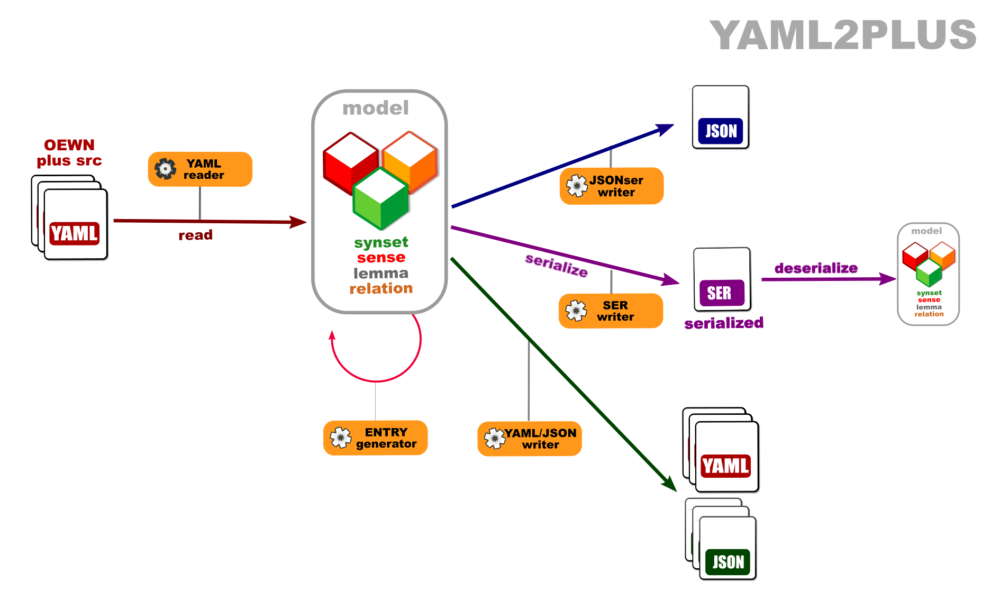
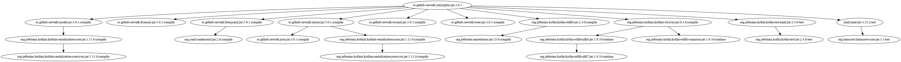

# Open English Wordnet YAML+-to-YAML grinder

This library reads a model from YAML files and writes it to YAML format.

Project [grind_yaml2plus](https://github.com/oewntk/grind_yaml2plus)

See also [model](https://github.com/oewntk/model/blob/master/README.md).

See also [fromyaml](https://github.com/oewntk/fromyaml/blob/master/README.md).

See also [toyaml](https://github.com/oewntk/toyaml/blob/master/README.md).

See also [oewntk](https://github.com/oewntk)
and [globalwordnet/english-wordnet](https://github.com/globalwordnet/english-wordnet).

## Dataflow

This library reads from the OEWN distribution YAML files and other YAML files that contain extra data.

This output conforms to the **YAML** standards.

## Command line

`grind.sh [options] source (source2) output`

#### Command line arguments

| arg       | type    | short | long       | definition                       | default   |
|-----------|---------|-------|------------|----------------------------------|-----------|
| in        | String  |       |            | Input dir or file                |           |
| out       | String  |       |            | Output dir or file               |           |
| in2       | String  | i2    | in2        | Optional extra input dir or file | yaml2     |
| operation | String  | do    | operation  | Operation                        | nothing   |
| inFormat  | String  | if    | in_format  | In format                        | yaml      |
| inPlus    | Boolean | p     | plus       | Plus input                       | false     |
| outFormat | String  | of    | out_format | Output format                    | yaml      |
| outInfo   | String  | i     | out_info   | Output info                      | oewn.info |
| outOne    | Boolean | 1     | out_one    | Output one file                  | false     |
| outMerge  | Boolean | m     | merge      | Do not group generated entries   | false     |
| verbose   | Boolean | v     | verbose    | Verbose output                   | false     |

## Maven Central

		<groupId>io.github.oewntk</groupId>
		<artifactId>yaml2plus</artifactId>
		<version>2.3.2</version>

## Dependencies

